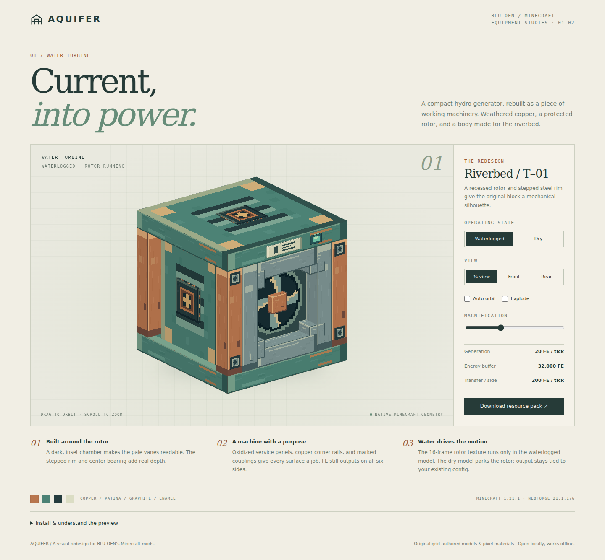

# Redesign for turbine — Riverbed / T–01

Part of **Aquifer**, a shared visual direction for BLU-OEN’s Minecraft equipment: weathered copper, dark metal, patina and sea glass.

A one-block hydro generator with a copper exoskeleton, oxidized service panels, stepped steel rotor rims, recessed four-vane rotors, central bearings and marked energy couplings. The 16-frame rotor texture runs only while waterlogged; the dry variant parks it. All eight existing facing/waterlogged combinations are covered.



## Open the design

Download this folder, then double-click **redesign for turbine.html**. The file includes the model, textures and resource-pack download, so it works offline without a server or JavaScript packages. GitHub displays HTML source; open a downloaded copy in a browser.

Drag to orbit, scroll to zoom, or focus the canvas and use the arrow and +/− keys. Use the view and equipment/state controls to inspect the design. Explode separates components for inspection only. Automatic orbit is off by default; rotor animation respects reduced-motion preferences.

## Use in Minecraft

1. Keep the original mod installed in Minecraft **1.21.1 / NeoForge 21.1.176**.
2. Copy **redesign-for-turbine.zip** into the instance’s `resourcepacks` folder. Leave it zipped.
3. Enable the pack above the mod’s built-in resources in **Options → Resource Packs**.
4. Inspect the item and worn/block appearances in your test world.

This is an optional client resource pack (pack format 34). It needs no server installation and adds no Java dependencies.

## What is included

- `redesign for turbine.html`: self-contained interactive preview and ZIP download.
- `redesign for turbine.json`: standalone editable Java Block/Item geometry.
- `resource-pack/`: unpacked game assets using the mod’s existing namespace.
- `redesign-for-turbine.zip`: installable pack, with `pack.mcmeta` at the archive root.
- `build.mjs`: original grid-authored geometry and pixel-material generator; no dependencies.
- `preview-template.html`: editable viewer layout and WebGL renderer.
- `validate.mjs`: asset references, UV, image and state checks.

For Blockbench, import the model JSON as a Java Block/Item model and load `resource-pack/assets/waterturbine/textures/redesign/materials.png` as its materials texture. The rotor uses a separate texture; use rotor_dry.png when editing geometry.

## Rebuild

From this folder, using Node.js 18 or later:

```sh
node build.mjs
node validate.mjs
```

The build regenerates geometry, PNG textures, the ZIP and the offline preview. Edit the build source before rebuilding; generated asset edits are overwritten. `preview.png` is a browser capture and is not regenerated by this command.

## Rendering scope

The full-block collision, waterlogging, particles, six-sided FE output and energy settings are defined by the original mod. This pack does not change them. The rotor is an animated texture inside a static model, not a rotating mesh. The face lamp is decorative, not a live energy indicator. The preview lists the existing default energy settings; your configuration may differ.

The browser uses exported geometry and textures with studio lighting. Minecraft’s world lighting, mipmaps, player skin and equipped armor rendering can look different. Asset validation and browser checks have been run; **these redesigns have not been tested inside Minecraft**.

## Format references

- [NeoForge 1.21–1.21.1 model specification](https://docs.neoforged.net/docs/1.21.1/resources/client/models/)
- [Minecraft 1.21 resource pack version 34](https://www.minecraft.net/en-us/article/minecraft-java-edition-1-21)

License: MIT, as in the parent repository.
